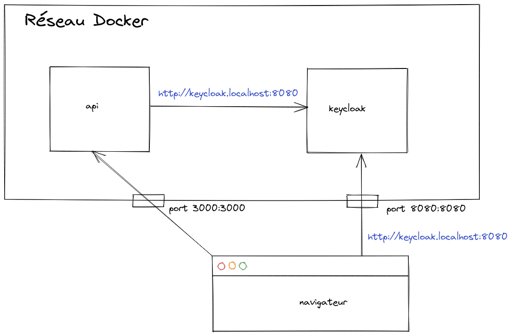

# URLs partagées dans Docker

Docker est de plus en plus utilisé durant la phase de développement pour réduire le temps de démarrage initial. Plus particulièrement dans les applications où plusieurs services doivent communiquer, son utilisation avec Docker Compose n'est pas rare. Voici une astuce intéressante qui permet d'utiliser les mêmes URL à l'intérieur du réseau Docker Compose et sur la machine locale.

Supposons qu'une application se compose de trois services :

* web, une application client qui s'exécute dans le navigateur et qui parle l'API;
* api, une API REST;
* keycloak, un logiciel permettant d'instaurer une méthode d'authentification unique à travers la gestion par identité et par accès.

L'application web s'attend à recevoir ses données de l'API. Par contre, pour y accéder, l'utilisateur doit préalablement s'authentifier. L'application web commence par demander à Keycloak d'authentifier l'utilisateur. En échange, elle reçoit un jeton représentant l'utilisateur. À chaque appel, l'api demande à Keycloak de valider le jeton. Pour que cette validation fonctionne, les urls doivent être identiques.

<p align="center">
  

  <br>
  <b>Émission de l'attestation d'identité vérifiable à l'utilisateur</b>
</p>

L'astuce pour y parvenir consiste à utiliser un domaine .localhost, qui est généralement résolu à l'adresse 127.0.0.1. Cela signifie que les ports exposés à partir des conteneurs Docker sont accessibles via http://<un-nom>.localhost:<port-exposé> à partir de sa propre machine en dehors du réseau Docker. À l'intérieur de la configuration réseau de Docker Compose, vous pouvez ajouter un alias réseau :
```yaml
# docker-compose.yml
keycloak:
  …
  ports:
    - "8080:8080"
  networks:
      default:
        aliases:
          - "keycloak.localhost"
api:
  …
  environment:
    KEYCLOAK_URL: "http://keycloak.localhost:8080"
    …
```  
  De cette façon, la même combinaison nom d'hôte + port est résolue pour le même service à l'intérieur du réseau Docker Compose ainsi que de l'extérieur (dans le navigateur).
  
  Réféerence: https://bitcrowd.dev/shared-docker-urls
